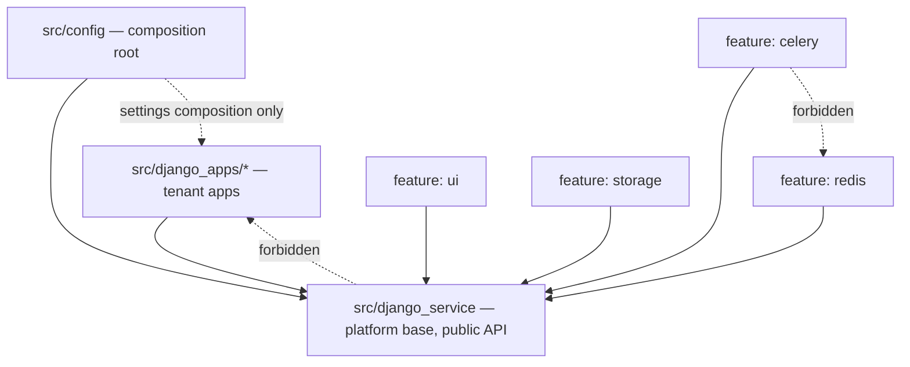
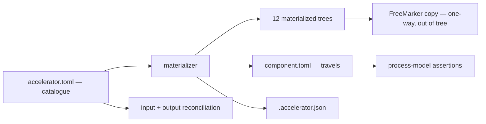
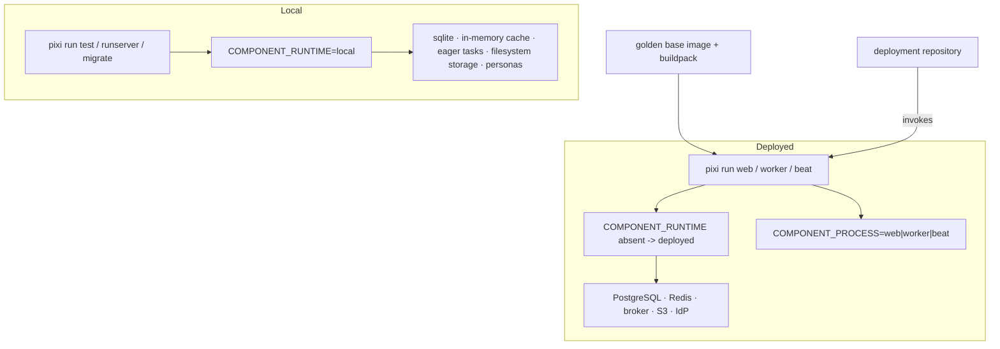

# Architecture Spine — django-15-factor-base

## Design Paradigm

**Two products share one tree, and the disposition system is the boundary between them.**

**The accelerator** is *manifest-driven projection*: one hand-authored catalogue, many derived artifacts. Twelve materialized source trees, the strip/parameterize/keep disposition, the orphan checks, the process-model assertions and the eventual FreeMarker copy are all projections of `accelerator.toml`. Nothing infers a feature's extent from naming or directory layout.

**The component** is *layered Django with a composition root*, plus an additive plugin space:

| Layer | Namespace | Role |
| --- | --- | --- |
| Composition root | `src/config/` | Settings, URL configuration, observability, authorization, startup refusals, entrypoints. Assembles; owns no domain. |
| Platform base | `src/django_service/` | Stable public API. Named identically in every deployment. |
| Tenant space | `src/django_apps/` | A path root, not a package. Reusable apps live here in development and graduate to channel packages. |

Two declarations, not one, and the split is load-bearing: `accelerator.toml` is the accelerator's catalogue and never travels; `component.toml` is the component's statement about itself and always travels. A rule that a materialized component must obey at runtime cannot live in a file it does not have.

## Invariants & Rules

### AD-1 — `accelerator.toml` is the single declarative catalogue

- **Binds:** FR-24, FR-28, FR-29, FR-30, FR-37, NFR-5
- **Prevents:** five PRD requirements depending on a declaration with no file, no format and no owner; a feature's extent being inferred from directory layout.
- **Rule:** Every feature's package surface, non-package surface, constraints and presets; every path's disposition; every parameter and its sites; the tenant-space location; the pinned all-pairs subset; and the closed contributable surface are declared in `accelerator.toml` at the repository root, and nowhere else. It is `machinery` and never travels. Anything a *component* must know about itself at runtime or deploy time belongs in `component.toml` instead (AD-28).

### AD-2 — Every path carries exactly one disposition, and output is reconciled separately

- **Binds:** FR-28, FR-29, FR-37
- **Prevents:** an unlisted path silently travelling into every component; a developer's own app being deleted or reported as an orphan; a generated artifact having no legal existence.
- **Rule:** Four *input* dispositions, exhaustive and mutually exclusive — `core` (always travels), `feature:<name>` (travels only where selected), `tenant` (never judged, never pruned), `machinery` (never travels). Unlisted defaults to `machinery`. Disposition answers only *does this path travel*; what is substituted inside it is the orthogonal parameter axis (AD-25), and feature-owned regions inside a `core` path are AD-24.
  Two reconciliation checks, both in the gate. **Input**, against the reference application: a path claimed by no disposition fails; a claim naming a path that does not exist fails. **Output**, against each materialized tree: every path is either a copied path with a travelling disposition or a declared generated artifact, and nothing else.

### AD-3 — Materialization is subtractive and carrier-driven; dependencies are native pixi features

- **Binds:** FR-2, FR-30, FR-32, NFR-5, SC-1
- **Prevents:** twelve independent dependency solves; a combination passing its gate in an environment fat enough to hide an import it should not have; twelve combinations silently testing two different Django versions.
- **Rule:** The materializer copies the reference application and removes what the carrier says the combination did not select, at path granularity (AD-2) and region granularity (AD-24). The four selectable features are declared as pixi features with an `[environments]` matrix, so one `pixi.lock` yields twelve pre-locked environments; combination *n*'s gate runs its materialized source under environment *n*. **All twelve environments share one `solve-group`**, without which `django-celery-beat`'s `django <6.1` cap makes the four Celery combinations resolve a different Django from the other eight and SC-1 stops meaning what it says. Feature configuration is **subtractive**; reusable-app configuration is **compositional** (AD-8); the two are not interchangeable. The reference application remains a real, runnable, gateable Django application throughout. Determinism is asserted: a gate test materializes one combination twice and requires byte-identical trees.

### AD-4 — Dependency direction across the three territories

- **Binds:** all
- **Prevents:** a base that depends on what is built on it; feature surfaces that cannot be independently removed.
- **Rule:** A tenant app may import `django_service`. `django_service` may never import a tenant app. `config` may import `django_service` and reaches tenant apps only through the settings composition step, never by direct import. A feature's code may never import another feature's.



### AD-5 — `django_service` is public API with a declared version

- **Binds:** FR-37, and every reusable app
- **Prevents:** a reusable app silently breaking on a component whose base moved beneath it; a routine tidy-up inside the base becoming an estate-wide break.
- **Rule:** The package name `django_service` is a constant, never parameterized — reusable apps import from it by that name in every deployment. Moving a module within the guaranteed surface (AD-29), changing `AUTH_USER_MODEL`, or renaming a guaranteed setting is a breaking change. `django_service.__api_version__` is a single integer, bumped by hand on any breaking change and on the removal of any guaranteed surface. A reusable app declares its supported range as `MIN <= v <= MAX` integers **in its contribution module**, not in package metadata — an in-repo app has no distribution metadata, and AD-8 refuses to let the two residency modes diverge. The adoption gate test asserts compatibility from that constant, so it runs identically in both residencies.

### AD-6 — `src/django_apps/` is a path root, not a package

- **Binds:** FR-18, FR-49, AD-5
- **Prevents:** an app's import path changing at the moment it becomes reusable, breaking every consuming component's `INSTALLED_APPS`, imports and migration references.
- **Rule:** `src/django_apps/` contains no `__init__.py`. An app at `src/django_apps/billing/` is imported and installed as `billing`, unqualified. Graduating it to a channel package changes its residency and never its import path.

### AD-7 — Import roots are declared once, and every declaration site is named

- **Binds:** AD-6, FR-38
- **Prevents:** a second source root working under `pytest` and failing under `gunicorn` — the failure this rule exists to stop, which survives a rule that names only `sys.path`.
- **Rule:** There are five import-root declaration sites in this repository and after this AD there is one. Removed: the `sys.path` inserts in `manage.py:24-26`, `asgi.py:18-20` and `wsgi.py`; `pyproject.toml` `[tool.pytest.ini_options] pythonpath`; and `--app-dir src` in the `serve` task. Retained: `[tool.hatch.build.targets.wheel]`, which declares both roots via a `sources` remapping of `src/` and `src/django_apps/` — a directory-level construct, so adding an app needs no per-app edit and AD-6's graduation promise holds. `uvicorn --app-dir` accepts one directory and is therefore never a declaration mechanism.

### AD-8 — A reusable app contributes configuration additively, on a closed surface

- **Binds:** FR-17, FR-38, FR-49, AD-5
- **Prevents:** adopting an app being a hand edit repeated in every component; an installed package acquiring visibility of, or authority over, every request.
- **Rule:** An app ships a declared contribution module. The composition step (AD-26) merges contributions from the `component.toml` adopted-app list. Introducing a new key is permitted; touching an existing key raises `ImproperlyConfigured`. Contributions to an **ordered sequence** — `INSTALLED_APPS`, `DATABASE_ROUTERS` — append only, in adopted-app-list order.
  The contributable surface is closed and enumerated in `accelerator.toml`, **by explicit key, never by namespace**: additional `DATABASES` entries and their routers, `INSTALLED_APPS` entries, the app's own namespaced settings, and named non-global DRF and Celery keys. No global-default key is contributable — `DEFAULT_AUTHENTICATION_CLASSES`, `DEFAULT_PERMISSION_CLASSES`, `MIDDLEWARE`, `AUTHENTICATION_BACKENDS` are refused whether or not the base already sets them, because "introducing a new key is permitted" would otherwise hand an adopted app authorization over every API request. The permitted-key list and the FR-17 allowlist are **one declaration**, not two lists maintained apart.
  A contribution naming a feature the combination did not select is refused at settings import, so an app cannot contribute `CELERY_BEAT_SCHEDULE` into a component with no Celery and have its scheduled work silently never run.
  Adoption is explicit — a `pixi.toml` line and a `component.toml` entry. Nothing self-registers; entry-point discovery is forbidden because an in-repo app has no distribution metadata and the two residency modes would diverge.

### AD-9 — A contributed database is a chain, not a setting

- **Binds:** FR-13, FR-18, FR-41, FR-42, AD-8
- **Prevents:** six enforcement points each being answered differently by six epics.
- **Rule:** An app contributing a database must also contribute a router that answers only for its own labels and returns `None` otherwise. Release-stage migration becomes one step per database, and `component.toml` declares them so the deployment repository does not have to guess. The stage-2 unapplied-migrations refusal and the sqlite refusal both iterate every configured database — which is only possible because stage 1 runs *after* composition (AD-26). Local substitution is applied automatically by the base, so FR-18 stays true by construction. Readiness treats a contributed database as required unless `component.toml` declares it optional.

### AD-10 — The mapper is two operations at different frequencies

- **Binds:** FR-5, FR-8, FR-9, SC-6
- **Prevents:** the only two outcomes of conflating them — `auth_user_groups` write amplification on every API call, or stale authorization.
- **Rule:** **Resolve** takes claims and returns the user by the identity key. It runs on every authentication, including every Bearer request, and is a single indexed read. **Sync** diffs asserted groups against stored ones, adds, removes, sets staff and superuser, and emits the structured log line. It runs once per credential epoch: every interactive login, and once per Bearer token at first sighting of its `jti`. Sync runs inside one transaction, which makes FR-9's add-then-remove ordering a detail rather than a security property.
  **The epoch record lives in the database**, in a `django_service`-owned table, not in `django.core.cache`: eight of twelve combinations have no Redis, so the cache is Django's in-process backend and "first sighting" would degrade to first-sighting-per-worker-per-restart. The table is pruned by a declared admin process alongside sessions (AD-31). It is internal surface (AD-29), so adding it is not an API version bump.
  **A token with no `jti` is rejected with 401.** Without this rule, one builder syncs every request and one never syncs again, delivering both of the outcomes this AD claims to prevent.

### AD-11 — One identity key, three separated roles

- **Binds:** FR-8, FR-9, FR-11, SC-6
- **Prevents:** account takeover through a mutable or collidable claim; the same person resolving to two users depending on which flow saw them first.
- **Rule:** **Credential** is what the IdP verifies — the enterprise username and whatever policy sits behind it. A deployed component authenticates nobody. **Identity key** is `User.idp_subject`: unique, indexed, nullable, populated from the claim the claims contract designates, and the sole store. The allauth adapter resolves through the mapper too; `SocialAccount` is bookkeeping, not authority. **Attribute** is `username`, `email`, `name` — populated from claims, displayed, used in URLs, never resolved by. `USERNAME_FIELD` remains `username`.

### AD-12 — The mapper's edge behaviours are fixed

- **Binds:** FR-8, FR-9, FR-10, FR-11
- **Prevents:** a misconfiguration presenting as a permissions bug; IdP group taxonomy silently becoming Django taxonomy; an `IntegrityError` mid-authentication.
- **Rule:** A token lacking the configured group claim is rejected with 401, never authenticated with zero groups. A claim asserting a group with no matching Django `Group` is ignored and logged, never created — which is safe only because AD-27 guarantees the designated groups exist. `is_staff` and `is_superuser` are each set from their own designated group and cleared when the claims stop asserting it. A `username` collision between two distinct `idp_subject`s is refused and logged; the second identity keeps its existing username and authenticates normally.

### AD-13 — Locality and process type are declared per pixi task

- **Binds:** FR-12, FR-13, FR-14, FR-40, SC-5
- **Prevents:** the declaration travelling into the deployed image and inverting the fail-closed property; the entire test suite refusing to start on the day the refusal contract lands; `sys.argv` sniffing.
- **Rule:** `COMPONENT_RUNTIME=local` is set in the `env` of each local pixi task. `web`, `worker` and `beat` set no runtime and inherit *deployed*; each sets `COMPONENT_PROCESS`. **No `COMPONENT_*` variable may appear in `[activation.env]`**, and a gate test asserts it over the materialized `pixi.toml` — the golden base runs pixi, so activation env reaches production, and `COMPONENT_PROCESS` placed there would make every management command declare itself a serving process and deadlock the release stage on the migrations refusal.
  Locality fails closed: absent or unrecognized means deployed. Process type fails open: absent means not a serving process, because failing it closed would produce exactly that deadlock.

### AD-14 — The process model is pixi tasks; its constraints are component data

- **Binds:** FR-40, FR-41, FR-43, SC-3
- **Prevents:** inventing a Procfile the deployment repository may not read; a `worker` task surviving into a component with no Celery and the deployment repository trying to run it.
- **Rule:** `web`, `worker` and `beat` are pixi tasks; the deployment repository invokes `pixi run <process>` and enumerates them with `pixi task list`. `worker` and `beat` are feature-owned regions of `pixi.toml` under AD-24 — pruning them is sub-file removal by declared marker, not something that happens for free. Replica counts and replacement strategy — `beat` is exactly one replica and must be stopped before its replacement starts — live in `component.toml`. The gate test is **two-way**: every process type the declaration names has a matching task, *and* every task in the materialized `pixi.toml` process group is named by the declaration.

### AD-15 — The component is a payload, not an image

- **Binds:** FR-38, FR-39, SC-3, NFR-3
- **Prevents:** every component acquiring an opt-out from the platform image pipeline, which would turn a base-image CVE bump into N pull requests.
- **Rule:** Materialized components ship no Dockerfile; the buildpack and golden-base path is the default, and a component that genuinely needs its own build is a deliberate departure. FR-38 and FR-39 are properties of the application — starts from environment variables alone, under an arbitrary non-root UID, writing nothing outside a temporary directory. This repository will ship a Dockerfile as `machinery` — none exists today — so the harness can verify those properties. AD-32 governs the one component shape that inherits it.

### AD-16 — No network surface exists beneath Django's routing

- **Binds:** FR-17, SC-5
- **Prevents:** a credential or network surface that the route allowlist cannot see because it is not a route.
- **Rule:** `asgi.py` exposes Django's ASGI application directly. `src/config/websocket.py`, the scope-dispatching wrapper, and its `[tool.coverage.run] omit` entry are all deleted together. Any future protocol handled below Django's URL resolver is a designed feature with its own authentication story and its own entry in the carrier, never an inherited handler.

### AD-17 — The provenance stamp is a receipt, not configuration

- **Binds:** FR-36, NFR-5
- **Prevents:** a non-deterministic materialization; a misleading provenance record in a repository that was forked rather than generated.
- **Rule:** The materializer writes `.accelerator.json` at the root of materialized output: accelerator version, source ref, and the full order values, serialized with sorted keys. **No timestamp** — it would break determinism, and git already records when. It is a declared generated artifact under AD-2's output reconciliation, never hand-edited. The reference application carries no stamp.

### AD-18 — One gate, one invocation, Linux for the matrix

- **Binds:** FR-32, CG-1, CG-2, NFR-4, SC-1
- **Prevents:** the orphan detector being disabled by a change nobody understood as security-relevant; thirty-six gate runs that cannot exercise the process model.
- **Rule:** A single workflow invokes `pixi run ci`, which has never run in CI. Template coverage moves out of the SonarCloud workflow and `build` off its fortnightly cron. The twelve-combination harness is Linux-only, `gunicorn` having no win-64 build; the three-OS matrix stays on the reference application, where it claims something different. Type checking is strict — `[tool.mypy]` sets `check_untyped_defs` today, not `strict`, and three documents already assert otherwise.

### AD-19 — Verification is reduced on PR, full on merge, and the subset is pinned

- **Binds:** FR-32, FR-35, CG-2, SC-1, NFR-5
- **Prevents:** a silently truncated verification set reading as full coverage; an exclusion report that says something different every run and is therefore reported but not reviewable.
- **Rule:** A pull request runs an all-pairs subset and reports which combinations it did not cover; merge to `main` runs all twelve plus the smoke-check level. Several distinct sets satisfy the all-pairs predicate, so the subset is **pinned as data in `accelerator.toml`**, with a gate test asserting the pinned set actually satisfies the predicate. This is sound only because generation happens from a released, tagged version and never from `main` HEAD; the exception is AD-32.

### AD-20 — The coverage floor is a single global constant, and what it measures is closed

- **Binds:** FR-29, FR-32, CG-1, SC-1, SC-2
- **Prevents:** a per-combination floor becoming the place a structurally sparse combination hides; and the narrowing that is already precedented in this tree — `[tool.coverage.run] omit` — being used to clear the floor while every stated rule still passes.
- **Rule:** Ninety percent, including templates, everywhere. `COVERAGE_CORE=ctrace` travels with every combination and a test asserts it is in force during a gate run. Never a lower floor, a pragma, or a narrowed measurement. **The coverage `omit`/`exclude` list is a closed, carrier-declared surface** subject to two-way reconciliation, and the gate asserts the effective omit list equals the declared one — otherwise an epic clears its floor with one line and the only residue detector the product has goes blind.
  **Bring-up mode, time-boxed:** `test-cov` already carries `--cov-fail-under=90`, so the floor is hard the moment the gate consolidates. Until the materializer has reported all twelve numbers once, materialized-combination gates run with the floor advisory and the numbers published as an artifact. The exit condition is that report; after it, the floor is hard everywhere and a combination that misses is answered with tests.

### AD-21 — The local sign-in path is a URL route, and the refusal resolves its view

- **Binds:** FR-13, FR-15, FR-17, FR-19, SC-4, SC-5
- **Prevents:** the product's own credential path taking a shape the refusal contract cannot see; and — the subtler half — a route that satisfies this AD by name and still evades the refusal because the predicate matched a string.
- **Rule:** Local persona sign-in is exposed as a URL route and by no other mechanism — not a development authentication backend, not a management command that writes a session, not a query-parameter shim. Its URL name and path prefix are fixed constants declared in `accelerator.toml`. The stage-2 predicate refuses any route whose **view callable belongs to the local sign-in module** (AD-26), never a name or prefix match, because a route named `local_persona_login` mounted under `/accounts/` would otherwise satisfy this AD and pass an allowlist that already permits `/accounts/` for allauth. It ships in every component and is refused wherever the component is deployed.

### AD-22 — Health, drain and migration ordering

- **Binds:** FR-41, FR-42, FR-43, NFR-2, NFR-3, SC-3
- **Prevents:** a liveness probe that turns a brief database outage into an estate-wide crash loop; an entrypoint that migrates and races across replicas; a drain that finishes in-flight work while traffic is still arriving.
- **Rule:** Liveness checks nothing external — the process answers or it does not. Readiness checks that every required database answers (AD-9), returns non-200 from process start until first successful contact, and never re-checks migrations, because during a rolling deploy an older replica may legitimately run against a newer schema. No entrypoint, task or container command runs migrations; migration is a release-stage step the deployment repository performs before new pods serve, one per database as `component.toml` declares, and the stage-2 refusal enforces that a serving process never starts against an unrecognized schema. On `SIGTERM` readiness flips *before* the drain begins, then the process stops accepting connections, finishes in-flight requests and exits; a worker finishes its current task and declines new ones. The component owns the ordering; the grace period is the deployment repository's.

### AD-23 — JWKS rotation is solved by key ID, and we build it

- **Binds:** FR-5, FR-13, FR-23
- **Prevents:** a cache TTL that must be tuned against an IdP policy nobody has published; a boot that reaches the network; and the assumption that the library already does this.
- **Rule:** JWKS is fetched lazily on the first Bearer request that needs it, never at import or boot. Keys are cached by `kid`. A token presenting an uncached `kid` triggers one refetch, rate-limited so an attacker cannot drive fetches. TTL is a backstop for key removal only. The trust anchor is derived from the configured OIDC issuer; a JWKS location not derived from it is refused at startup.
  **PyJWT does not provide this.** `PyJWKClient.cache_keys` defaults to `False`, its unknown-`kid` refetch has no rate limiting or backoff, and its LRU has no TTL. This policy is component code wrapping PyJWT, and the tests belong to it.

### AD-24 — A `core` path carries feature-owned regions by declared markers, and by no other mechanism

- **Binds:** FR-2, FR-28, FR-30, AD-2, AD-3
- **Prevents:** two builders splitting on markers versus file-extraction and producing incompatible trees; a missed region leaving `CeleryInstrumentor().instrument()` in eight combinations whose environment no longer contains the instrumentor — an `ImportError` at boot that path-level reconciliation cannot see.
- **Rule:** Three `core` paths carry feature-owned regions and are the reason this exists: `src/config/settings/base.py` (the Celery block at `:296-313`, feature entries in the installed-app lists), `src/config/observability/telemetry.py` (the per-instrumentor calls at `:134-137`), and `pixi.toml`. A region is delimited by paired line comments in the file's own comment syntax, `feature:<name>` / `/feature:<name>`, and every region is declared in `accelerator.toml` with its path and feature. Reconciliation extends to regions in both directions: a marker naming an undeclared feature fails; a declared region whose markers are absent from the named file fails; an unbalanced marker pair fails. No other sub-file removal mechanism is permitted — not conditional imports, not settings-module inheritance, not `try/except ImportError`.

### AD-25 — Parameterization is an orthogonal axis, not a disposition

- **Binds:** FR-31, FR-36, FR-37, NFR-5
- **Prevents:** `sonar-project.properties`'s hardcoded key travelling as `core` so every component's metrics merge into this project silently — nothing failing, which is the exact consequence FR-37 names; and FR-31's fail-on-missing-fixture rule having nothing to compare against.
- **Rule:** A path has a disposition (AD-2) and, independently, a parameter set. `accelerator.toml` declares `[parameters]`: each parameter's name, its fixture value, and every exact path and token site it substitutes. Reconciliation covers it both ways — a declared parameter with no site fails, a site matching no declared parameter fails. The parameters are `sonar-project.properties` (project key), `README.md`, `CHANGELOG.md`, `LICENSE`, `pyproject.toml`, `mkdocs.yml`, and the component name — which is a multi-site substitution spanning `pixi.toml` `[workspace] name`, `pyproject.toml` `[project] name`, the `[pypi-dependencies]` self-install key and `[pypi-options] no-build-isolation`. `src/django_service/` is **not** a parameter (AD-5). Building the materializer before parameterization exists re-cuts every carrier entry, every fixture and every combination's gate output, so it does not happen in that order.

### AD-26 — The refusal contract has one location, one owner, and a fixed order

- **Binds:** FR-12, FR-13, FR-14, FR-15, FR-16, FR-17, SC-5, NFR-1
- **Prevents:** the product's highest-consequence surface being split across two modules by two builders who both satisfy FR-12; stage 1 running before composition and never seeing a contributed database; an allowlist maintained apart from the conditions it backstops.
- **Rule:** The refusal contract is one module, `src/config/startup/`, containing both stages and the FR-17 allowlist.
  **Stage 1** is invoked as the **last statement of every settings module**, which places it after the AD-8 composition step by construction and is why AD-9's iteration over every configured database is reachable.
  **Stage 2** is owned by the `AppConfig.ready()` of one named immovable-core app in `django_service`, declared in `accelerator.toml`; no adopted app may precede it in `INSTALLED_APPS`, and a gate test asserts that ordering.
  **Predicates resolve objects, never strings.** The credential-path and local-sign-in conditions resolve the URLconf and refuse any route whose view callable belongs to the forbidden module — `obtain_auth_token`'s and the local sign-in module's — so renaming a route or remounting it under another prefix cannot evade them.
  The FR-17 allowlist and AD-8's permitted-contribution surface are the same declaration, so adding a credential path and adopting an app are checked by one mechanism rather than two that can disagree.

### AD-27 — Authorization data has an owner

- **Binds:** FR-9, FR-11, FR-19, SC-6, SC-7
- **Prevents:** the bootstrap deadlock in which every deployed component grants nobody any authorization and nobody can reach the admin, while all twelve local smoke checks pass.
- **Rule:** Django `Group` rows named by the claims contract, and the `Permission` rows attached to them, are provisioned by a data migration inside `django_service`, seeded from the claims contract, so they exist before the first authentication. The local persona seeding task **calls that same mechanism** rather than reimplementing it — a task that creates groups itself is what makes the deadlock invisible to the harness. A designated staff or superuser group absent from the database at startup is a stage-2 refusal condition, on AD-12's own reasoning: a misconfiguration must not present as a permissions bug.

### AD-28 — The component declares itself in `component.toml`

- **Binds:** FR-36, FR-40, AD-8, AD-9, AD-14, AD-22
- **Prevents:** a materialized component being unable to adopt a reusable app, declare an extra migration step, or state a database's requiredness, because every one of those rules lived in a file the component does not have.
- **Rule:** `component.toml` is `core` and always travels. It carries what a component states about *itself*: the adopted-app list, per-database requiredness, per-database release-stage migration steps, and the process-model constraints. `accelerator.toml` carries what the *accelerator* knows about all components: feature surfaces, dispositions, parameters, presets, the closed contributable surface, and the pinned verification subset. A rule a component must obey at runtime belongs in `component.toml`; a rule only the materializer needs belongs in `accelerator.toml`.

### AD-29 — `django_service`'s guaranteed surface is the intersection across all combinations

- **Binds:** FR-1, FR-3, SC-7, AD-5
- **Prevents:** a reusable app importing a module present in six combinations and absent from six, with a combination-invariant version constant that cannot express the difference; and a wholesale `feature:ui` disposition on `templates/` removing `base.html`, which the 403/404/500 pages extend, in the six combinations where FR-3 explicitly requires template rendering to work.
- **Rule:** No `feature:*` disposition may be applied to any path inside `src/django_service/`; it is `core` in its entirety, and a gate test asserts that. Surface that genuinely belongs to the server-rendered UI feature — user-facing page templates, form styling, user-facing views and forms — moves out of `django_service` into a feature-owned location before that feature is extracted. Error templates and `base.html` stay, because the admin and the error handlers need them in every combination. `accelerator.toml` enumerates the guaranteed surface explicitly; anything inside `django_service` not enumerated is internal and may change without a version bump.

### AD-30 — The smoke check asserts the immovable core, and the core has its own unprunable suite

- **Binds:** FR-1, FR-3, FR-33, SC-4, SC-7
- **Prevents:** the harness detecting residue and being structurally blind to excision damage — a feature extraction that removes too much passes every existing check, because the removed thing's tests left with it, coverage measures only what remains, and the smoke check never renders the page that broke.
- **Rule:** The smoke check asserts, for every combination, with no external service running: the process boots; readiness returns 200; a persona completes an interactive sign-in and reaches a **rendered admin index**; one Bearer request passes through the real authentication class; and one **rendered 404**. FR-1's consequence that an unreachable admin fails the smoke check is thereby true rather than assumed.
  Separately, a `core`-disposed immovable-core assertion suite runs inside every combination's gate and is never pruned by any feature. AD-20's coverage signal defends SC-2; this suite is what defends SC-7, and nothing else does.

### AD-31 — Session engine and identity-provider configuration are settings-resident

- **Binds:** FR-4, FR-38, FR-44, NFR-3, SC-3
- **Prevents:** session behaviour varying by feature toggle; and every deployed component redirecting to whatever callback domain a data migration baked in.
- **Rule:** `SESSION_ENGINE` is set explicitly in `base.py` to the database-backed engine, in every combination — the Redis feature may not change it, because FR-44's whole point is that session behaviour must not vary by toggle. Expired sessions and expired mapper epoch records (AD-10) are pruned by one declared admin process, not a background task, because Celery exists in only four of twelve combinations.
  allauth's OIDC provider is configured from `SOCIALACCOUNT_PROVIDERS` populated from the environment, never from database-resident `SocialApp` rows, which a component forbidden to migrate itself could never create. The `Site` domain is likewise environment-driven; the existing data migration at `src/django_service/contrib/sites/migrations/0003_set_site_domain_and_name.py` is retired rather than parameterized.

### AD-32 — The GitHub-template consumer is a named, governed exception

- **Binds:** AD-15, AD-17, AD-19, AD-28
- **Prevents:** a second, undocumented component shape with different capabilities and different guarantees emerging from the same architecture.
- **Rule:** "Use this template" produces a **fork of the base**, not a generated component, and the spine states its three differences rather than leaving them to be discovered. It copies the default branch, so AD-19's soundness precondition — generation only from a released tag — does **not** hold for it. It carries `accelerator.toml`, the materializer and the machinery Dockerfile, so it can adopt reusable apps and can opt out of the image pipeline where a materialized component cannot. It arrives unstamped (AD-17), which is the honest signal of all of the above. These are accepted, not mitigated; anyone using this path owns the consequences, and a component that must carry the platform's guarantees is materialized, not templated.

## Consistency Conventions

| Concern | Convention |
| --- | --- |
| Package naming | `django_service` is constant and never parameterized. Tenant apps are single unqualified names under `src/django_apps/`. Cross-cutting concerns with several independent consumers and no natural owner live under `src/config/<concern>/`, as `observability/` already does and `authorization/` and `startup/` will. |
| Environment variables | `COMPONENT_`-prefixed for component-level runtime facts, and never in `[activation.env]` (AD-13). Never `DJANGO_ENV` or a bare `ENV` — the platform is likely to set a generic `ENV=dev` for a development *deployment*, and a deployed dev environment is still deployed. |
| Declaration files | Hand-authored declarations are TOML and visible: `accelerator.toml`, `component.toml`, `pixi.toml`, `pyproject.toml`. Machine-written records are JSON and hidden: `.accelerator.json`. Format signals authorship. |
| Test location | Accelerator and base tests live under `tests/`, mirroring `src/`, and carry the disposition of what they cover — a feature's tests are `feature:<name>` and are pruned with it, except the immovable-core assertion suite (AD-30), which is `core`. A tenant app's tests live **inside the app**, because they must graduate with it. |
| Feature-conditional code | The two feature-scoped refusals (FR-14) are feature-owned regions declared under AD-24, not unconditional code guarded by a flag. |
| Configuration errors | Every forbidden or missing configuration raises `ImproperlyConfigured` at one of the two refusal stages. A refusal never degrades to a warning (CG-3). |
| Runtime errors | Authentication failure is 401. Cache failure is swallowed *and* logged, correlated with `request_id` and `trace_id`. Nothing is swallowed silently. |
| Logging | Structured, JSON to stdout, carrying `request_id`, `trace_id`, `span_id`. Every authorization change emits an event. No files, no rotation. |
| Supply chain | conda-forge only; `[pypi-dependencies]` carries the editable self-install and nothing else. Transitive availability is not declaration: a package the code imports directly is declared directly, even when something else already pulls it in. A reusable app must reach the channel before a component may depend on it. |
| Rationale | Reasoning lives beside the configuration it constrains, in the same file, as `pixi.toml` already does. |

## Stack

Verified against conda-forge and `pixi.lock` on 2026-08-15.

| Name | Version | Note |
| --- | --- | --- |
| Python | 3.14 | |
| Django | 6.0 | 6.1 is on the channel; `django-celery-beat` caps `<6.1`, hence AD-3's shared solve-group |
| django-allauth | 65.19.1 | Channel recipe declares only `asgiref`/`django`; `requests` is imported directly by the OIDC provider and must be declared (see divergence D-4) |
| djangorestframework / drf-spectacular | 3.18.0 / 0.30 | |
| PyJWT / cryptography | 2.13 / 50.0 | New; AD-23 wraps rather than relies on `PyJWKClient` |
| django-storages / boto3 | 1.14.6 / 1.43.65 | `boto3` already locked via `django-anymail`. `django-storages` released 2025-04-02, declares no Django 6.0 or py3.14 — see residual risk R-1 |
| Celery / django-celery-beat | 5.6 / 2.9 | |
| django-redis / redis-py | 7.0 / 8.1 | |
| psycopg | 3.3 | |
| structlog / django-structlog | 26.1 / 10.1 | |
| OpenTelemetry API/SDK | 1.44 | Traces only |
| gunicorn + uvicorn-worker | 26.0 + 0.4 | gunicorn 26 ships a native `asgi` worker; dropping `uvicorn-worker` is a spike, not a decision |
| whitenoise | 6.12 | |
| pixi | ≥ 0.70.2 | Per-task `env` confirmed available; the `[environments]` matrix is the AD-3 mechanism |

## Structural Seed

```text
django-15-factor-base/
  accelerator.toml            # machinery — catalogue: surfaces, dispositions, parameters, presets (AD-1)
  component.toml              # core — the component's statement about itself (AD-28)
  Dockerfile                  # machinery — payload verification only; does not exist yet (AD-15)
  pixi.toml                   # feature matrix, environments+solve-group, process tasks (AD-3, AD-13, AD-14)
  src/
    config/                   # core — composition root
      settings/               #   base + local + production + test; composition, then stage 1 last (AD-8, AD-26)
      observability/          #   existing cross-cutting home
      authorization/          #   the mapper (AD-10, AD-11, AD-12)
      startup/                #   both refusal stages + the FR-17 allowlist (AD-26)
    django_service/           # core in its entirety — no feature:* dispositions (AD-29)
    django_apps/              # tenant — path root, no __init__.py (AD-6)
  tools/materializer/         # machinery — projections of accelerator.toml (AD-3)
  tests/
```





## Capability → Architecture Map

| Capability / Area | Lives in | Governed by |
| --- | --- | --- |
| Immovable core (§4.1) | `src/config/`, `src/django_service/` | AD-2, AD-3, AD-5, AD-29, AD-30 |
| Authentication & authorization (§4.2) | `src/config/authorization/`, DRF auth class, allauth adapter | AD-10, AD-11, AD-12, AD-23, AD-27, AD-31 |
| Refusal contract (§4.3) | `src/config/startup/` | AD-26, AD-13, AD-9, AD-21, AD-27 |
| Local development contract (§4.4) | `pixi.toml` task env, settings `local` | AD-13, AD-9, AD-21, AD-27, AD-30 |
| Feature model & clean extraction (§4.5) | `accelerator.toml` | AD-1, AD-2, AD-24, AD-25, AD-29 |
| Verification model (§4.6) | `tools/materializer/`, CI | AD-3, AD-18, AD-19, AD-20, AD-30 |
| Deployment interface (§4.7) | `pixi.toml` tasks, `component.toml` | AD-14, AD-15, AD-17, AD-22, AD-28, AD-32 |
| Observability (§4.8) | `src/config/observability/` | Conventions; FR-45 and NFR-6 are open items below |
| Supply chain (§4.9) | `pixi.toml` | Conventions; residual risk R-1 |
| Reusable apps (new; not in the PRD) | `src/django_apps/` | AD-4, AD-5, AD-6, AD-7, AD-8, AD-9, AD-28, AD-29 |

## Named Residual Risks

Accepted, not mitigated. Recorded so the next reader does not take the rest of this document at face value.

- **R-1 — `django-storages` fitness is unproven, and object storage cannot be deferred.** Present on the channel, which is FR-50's test, but released 2025-04-02 with no declared Django 6.0 or Python 3.14 support and nothing newer available; Django 6.0 support exists only on unreleased upstream master. Object storage appears in six of twelve combinations, does not exist yet, and is expected to be selected by most components — so dropping it is not an available answer and the risk must be carried rather than avoided. The escalation is ordered: spike `1.14.6` against the locked Django and Python first, since it is a thin wrapper over a `boto3` already in the lock and Django's `Storage` API has been stable; if that fails, push the conda-forge feedstock as was done for `django-celery-beat`, with a **time-boxed** package-index exception whose exit condition is that build landing; a component-owned S3 backend against `django.core.files.storage.Storage` is the last resort, because a platform product owning its own storage backend is a permanent maintenance and security cost. A permanent supply-chain exception is not on the list.
- **R-2 — Bearer revocation latency is the token's lifetime.** AD-10 syncs once per `jti`, so a group revoked at the IdP is honoured until the token expires. Unavoidable for bearer credentials, but it narrows FR-9 and SC-6 and is not the same question as PRD Open Question 1, which covers sessions only.
- **R-3 — A serving process started outside `pixi run web` does not fire the migrations refusal.** The price of AD-13's fail-open process type, taken because failing it closed deadlocks the release stage.
- **R-4 — The GitHub-template path ships from `main` HEAD** and carries the machinery Dockerfile and the materializer. AD-32 states the consequences; nothing prevents them.
- **R-5 — Local development proves less than running suggests.** Inherited from the PRD's own risk register and not softened here: sqlite accepts schemas PostgreSQL rejects, eager execution never exercises delivery or retries, synthetic claims never exercise JWKS retrieval or rotation.

## Divergences From the PRD

Each needs the PRD amended or this spine corrected; they must not silently disagree.

- **D-1 — FR-37 lists `src/django_service/` as parameterized.** It is a constant (AD-5). This also dissolves the readiness review's S-5.
- **D-2 — FR-30 requires the materializer's declarations be "authored once and shared with the eventual template," cross-checkable during the transition.** The FreeMarker copy is one-way and out of tree, so this is "derived once, then drifts."
- **D-3 — FR-9's "on every authentication" is narrowed by AD-10** to once per credential epoch for the programmatic flow. Deliberate, and the consequence is R-2.
- **D-4 — §4.2 states the interactive flow "costs no new dependency."** It costs `requests`, which the channel recipe for `django-allauth` does not declare and which reaches the environment only transitively through the OTLP exporter.
- **D-5 — The PRD does not know about reusable apps, `src/django_apps/`, or the GitHub-template consumer.** All three are user constraints gathered during this run and govern real invariants here.

## Open Items

- **FR-45 — the OTLP export path end-to-end test** against a collector stub, inside every combination's gate. No AD; needs an owner and a stub design.
- **NFR-6 — telemetry overhead measured once and recorded.** No AD; needs an owner and a milestone.
- **The enterprise developer portal's order surface.** FR-31's fail-on-missing-fixture rule needs a field list. Until one exists the fixture set covers the AD-25 parameters and the four feature booleans. Owner: portal team.

## Deferred

- **The FreeMarker generator's input contract.** No longer blocking: the copy is one-way and out of tree, so nothing here depends on what that generator consumes.
- **Propagating an accelerator change into existing components.** PRD non-goal. `.accelerator.json` carries what a future tool would need.
- **Making the base a distributable package** rather than source a component contains. The clean end state for AD-5's versioning; a different product.
- **Metrics and the OTLP logs signal.** Additive to the existing traces-only setup.
- **Session revocation latency inside an established session.** PRD Open Question 1; the answer is a session-lifetime policy, not a mapper change. Owner: platform group.
- **Presets beyond the three named.** Cheap to add, constraining nothing.
- **All-pairs as the permanent policy.** FR-35 puts the switch at roughly thirty-two combinations; AD-19 uses it only as a per-PR trigger.
- **Dropping `uvicorn-worker` for gunicorn 26's native ASGI worker.** A spike, sequenced in the work-split.
